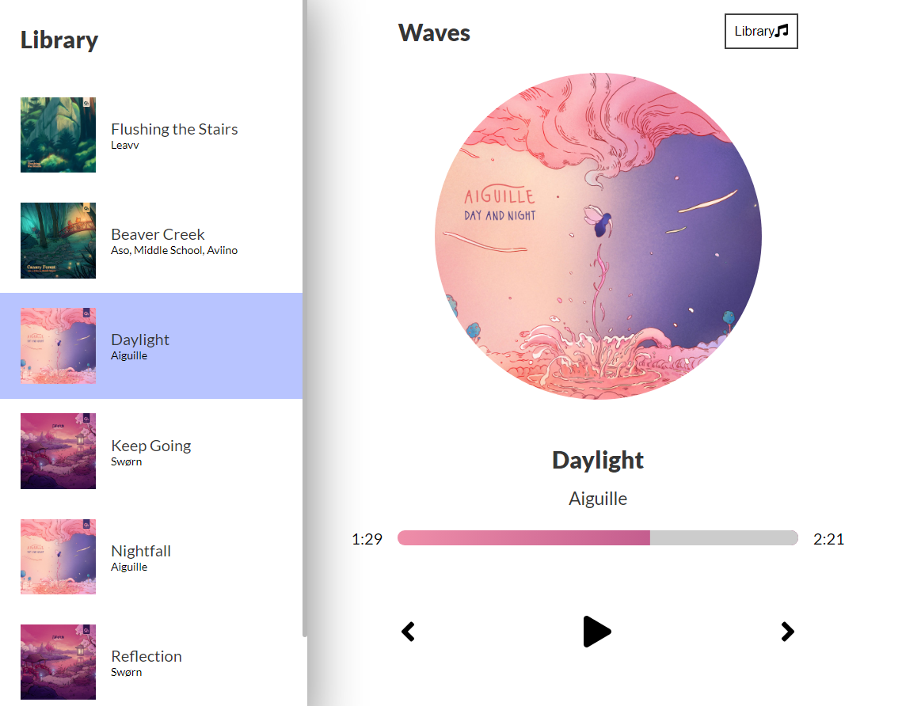

# Music App
Проект **Mucis Player** можно посмотреть по ссылке

### Описание

Данный проект написан на **`React`** и предоставляет возможность прослушивать музыкальные трэки, выбирать трэк из списка. Ральзован контроль преера такие как: пауза, проигровать, пролистывать вперед/назад, изменять в ручную текущую позицию бегунка. Реализована работа таймера, и возможность скрытия/открытия библиотеки. Плавная анимация. 

### Технологии

При разработке веб-приложения использованы следующие технологии:
* **`fontawesome библиотека`**
* **`препроцессор SCSS`**
* **`React`** с использованием **`функциональных компонентов`**
* **`animation`**

### План по доработке
* Реализыция закрытия открытой библиотеки по нажатия на overlay
* responsive/adaptive

### Запуск и установка
* `npm install` устанавка модулей, перечисленных как зависимости в package.json
* `npm start` запустить проект

